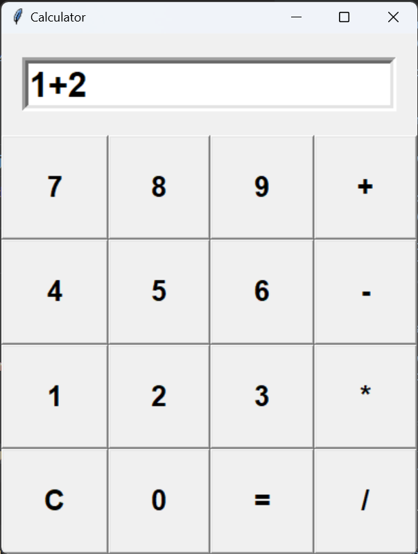

# Calculator

 

### Features

- **Basic Arithmetic Operations**: Supports addition, subtraction, multiplication, and division.
- **GUI Interface**: A user-friendly graphical interface for easy interaction.


### Technologies Used

- **Python**: Main programming language.
- **Tkinter**: Used for creating the GUI.
- **Modular Architecture**: Separated backend logic and GUI for maintainability.

### Installation and Usage

1. **Clone the Repository**:
   ```bash
   git clone https://github.com/your-username/calculator_project.git
   cd calculator_project

### TODO: 
 - **Memory Functionality**: Allows users to store and recall previous calculations.
 - **Error Handling**: Displays clear messages for invalid operations (e.g., division by zero).